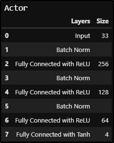
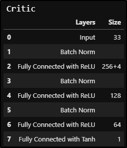
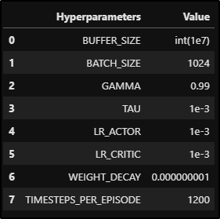
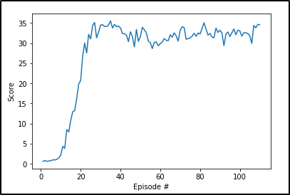

# 
Continuous Control

## 
Problem Statement

We explore how to use Actor-Critic Agents with Policy Approximation in this project. The Environment is **Reacher**(Unity Agents). In this environment, a double-jointed arm can move to target locations. A reward of +0.1 is provided for each step that the agent's hand is in the goal location. Thus, the goal of our agent is to maintain its position at the target location for as many time steps as possible.

There are two versions of the problem statement as follows: 
Option 1: Solve the First Version
The task is episodic, and in order to solve the environment, our agent must get an average score of +30 over 100 consecutive episodes.

Option 2: Solve the Second Version
The barrier for solving the second version of the environment is slightly different, to take into account the presence of many agents. In particular, our agents must get an average score of +30 (over 100 consecutive episodes, and over all agents).

### What is Actor-Critic(With Deep Deterministic Policy Gradient alias **DDPG**)?

**Actor Critic** Methods try to balance between variance and bias and maintain an optimal tradeoff between the two. It tries to approach an optimally balanced learning by considering the good aspects of both **Monte Carlo estimation** and **TD Estimation**. The Actor takes in a state and outputs a distribution over actions, while the critic takes in a state and outputs the state value function policy. In DDPG, the distribution aver the actions that the Actor learns is continuous(unlike vanilla Actor Critic where it is discrete). The Critic takes the Actors based believed action into consideration and learns the optimal value function.

The Actor Critic Agent is based on **Soft Updates** mechanism, ehere in we maintain two networks(called as **Regular** and **Target**) each for the Actor and the Critic. We learn the Regular netwrk and slowly blend(like 0.01%) the regular netwrk weights with the target network weights.

We also maintain an **Experience Replay** Buffer to learn from past experinces from different episodes.

## 
Solution/Implementation

As per the problem statement we go ahead to solve the **option 2**. 

#### Neural Architecture of the Actor and Critic 
  

#### Hyperparemters Used
 

The Solution was reached by 110 episodes, the plot is shown below. 
 

#### *Improvements to be done*
Utilize techniques like Prioritized Replay and A3C
